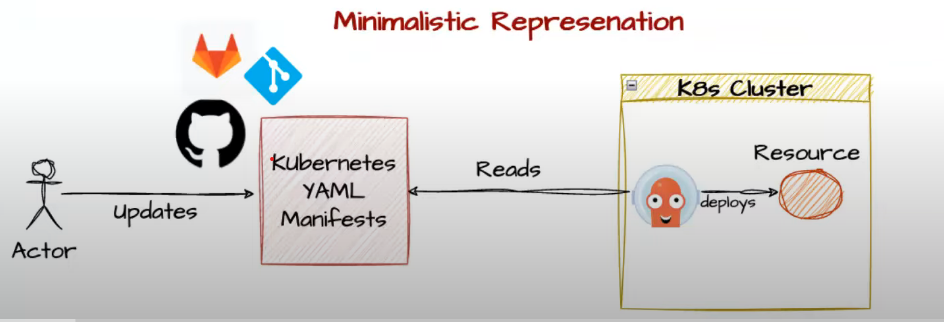
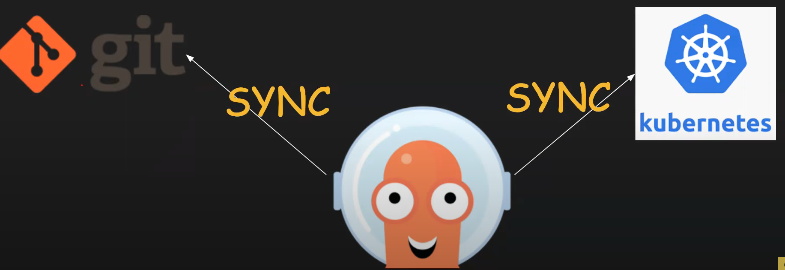

What is gitops ?

Gitops uses GIT as a single source of truth to deliver applications and infrastructure

Why to use Gitops ?
Provides details versioning/tracking/auditing 
Eg:- about changes by which user

In deployment we use git pull request verified by others and using  gitops controller (ArgoCD) applications are deployment
GitOps Application and Infrastructure

Mangaging large infra requires (100's K8s cluster) gitops add more value.

What are the 4 Gitops Principles ?

1 Decalrative - system managed by GitOps must have its desired state expressed declaratively (cide in config is always deployed in cluster)

2 Versioned and Immutable - Desired state is stored in a way that enforces immutability, versioning and retains a complete version history. 

3 Pulled Automatically - Software agents automatically pull the desired state decalrations from the source 

4 Continously Reconciled - Software agents continously observe actual system state and attempt to apply the desired state

GitOps is not for kubernetes only , But most of the popular gitops tools like ArgoCD and Flux target kubernetes

Advantages of Gitops ?

(1) Security (unwanted changes are removed)

(2) Versioning (track changes)

(3) Auto Upgrades

(4) Auto Healing of any unwanted changes

(5) Continous reconciliation

What are the popular gitops tools ?

ArgoCD
FluxCD
JenkinsX
Spinnaker

 Gitops in a nutshell

 

Maintains state between git and kubernetes (continously monitors state inbetween git and kubernetes reconciliation)

GitOps Architecure ?

Repo Server - Microservice connect to git and get state of the application

Application controller - Microservice connect k8s and get the state

API server - Microservuce used by user to communiate to ArgocD via UI or CLI, Should handle authentication (SSO,OIDC,LDAP,Dex default light weight OIDC)

Redis - Microservice for cacheing (suppose one component controller (stateful set) is down when it comes back up need data)

