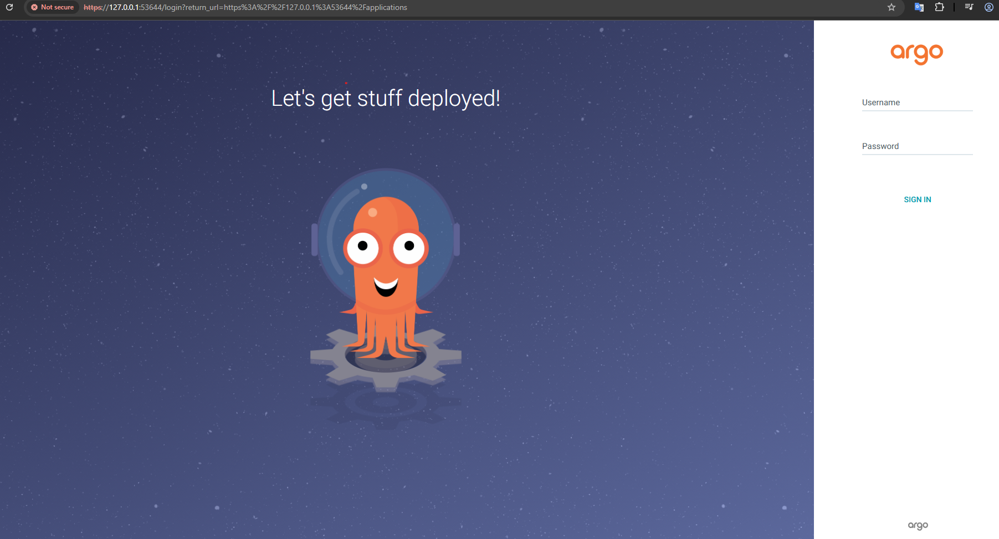
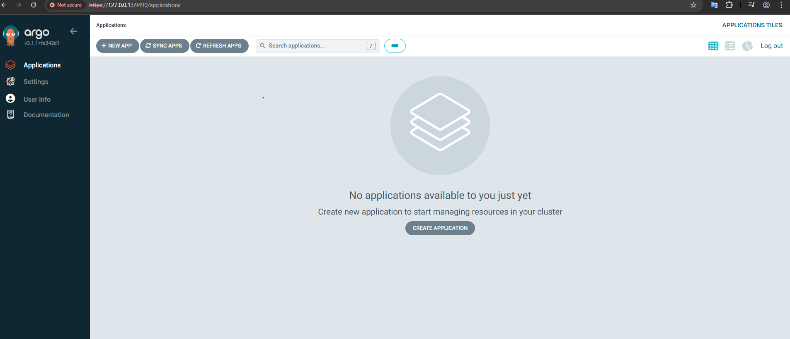

What is gitops ?

Gitops uses GIT as a single source of truth to deliver applications and infrastructure


Why to use Gitops ?
Provides details versioning/tracking/auditing 
Eg:- about changes by which user

In deployment we use git pull request verified by others and using  gitops controller (ArgoCD) applications are deployment
GitOps Application and Infrastructure

Mangaging large infra requires (100's K8s cluster) gitops add more value.

What are the 4 Gitops Principles ?

1 Decalrative - system managed by GitOps must have its desired state expressed declaratively (cide in config is always deployed in cluster)

2 Versioned and Immutable - Desired state is stored in a way that enforces immutability, versioning and retains a complete version history. 

3 Pulled Automatically - Software agents automatically pull the desired state decalrations from the source 

4 Continously Reconciled - Software agents continously observe actual system state and attempt to apply the desired state

GitOps is not for kubernetes only , But most of the popular gitops tools like ArgoCD and Flux target kubernetes

Advantages of Gitops ?

(1) Security (unwanted changes are removed)

(2) Versioning (track changes)

(3) Auto Upgrades

(4) Auto Healing of any unwanted changes

(5) Continous reconciliation

What are the popular gitops tools ?

ArgoCD
FluxCD
JenkinsX
Spinnaker

 Gitops in a nutshell

 

Maintains state between git and kubernetes (continously monitors state inbetween git and kubernetes reconciliation)

GitOps Architecure ?


1) Repo Server - Microservice connect to git and get state of the application

2) Application controller - Microservice connect k8s and get the state

3) API server - Microservuce used by user to communiate to ArgocD via UI or CLI, Should handle authentication (SSO,OIDC,LDAP,Dex default light weight OIDC)

4) Redis - Microservice for cacheing (suppose one component controller (stateful set) is down when it comes back up need data

Installation

Install Minikube https://minikube.sigs.k8s.io/docs/start/?arch=%2Fwindows%2Fx86-64%2Fstable%2F.exe+download
 
Install ArogoCD https://argo-cd.readthedocs.io/en/stable/getting_started/

(We can install using plain manifest easiest, helm chart and using operator)

Create kuberenetes controllers in personalized namespace so that we dont mess up (Eg: Istio)

```
kubectl create namespace argocd
kubectl apply -n argocd -f https://raw.githubusercontent.com/argoproj/argo-cd/stable/manifests/install.yaml

```
The manifests are ArgocD components (API server,Custom resources, network policies)

Check if all pods are up and running

```
 Deepak S   deepaks    kubectl get pods -n argocd                                                                     in pwsh at 15:47:47
NAME                                                READY   STATUS    RESTARTS   AGE
argocd-application-controller-0                     1/1     Running   0          3m4s
argocd-applicationset-controller-64b8948d8b-84jvz   1/1     Running   0          3m6s
argocd-dex-server-6f48b6c5c7-lm9xn                  1/1     Running   0          3m6s
argocd-notifications-controller-6c4547fb9c-k2gd4    1/1     Running   0          3m5s
argocd-redis-78b9ff5487-wxsq6                       1/1     Running   0          3m5s
argocd-repo-server-67d8c6bbf6-ldq27                 1/1     Running   0          3m5s
argocd-server-577756d78b-97wd7                      1/1     Running   0          3m5s
 Deepak S   deepaks                                                                                                   in pwsh at 15:47:58
```

Note:- Application set is a way of generation applications 

argocd-server service created for UI CLI interaction of users
```
 Deepak S   deepaks    kubectl get svc -n argocd                                                                      in pwsh at 15:53:27
NAME                                      TYPE        CLUSTER-IP       EXTERNAL-IP   PORT(S)                      AGE
argocd-applicationset-controller          ClusterIP   10.97.45.29      <none>        7000/TCP,8080/TCP            8m46s
argocd-dex-server                         ClusterIP   10.100.148.27    <none>        5556/TCP,5557/TCP,5558/TCP   8m46s
argocd-metrics                            ClusterIP   10.96.128.236    <none>        8082/TCP                     8m45s
argocd-notifications-controller-metrics   ClusterIP   10.108.101.36    <none>        9001/TCP                     8m45s
argocd-redis                              ClusterIP   10.108.153.146   <none>        6379/TCP                     8m45s
argocd-repo-server                        ClusterIP   10.109.239.254   <none>        8081/TCP,8084/TCP            8m45s
argocd-server                             ClusterIP   10.106.160.35    <none>        80/TCP,443/TCP               8m45s
argocd-server-metrics                     ClusterIP   10.108.54.149    <none>        8083/TCP                     8m45s
 Deepak S   deepaks           

```
Edit argocd-server service change type from ClusterIP to NodePort so that we can access it from terminal 


We need to do port forwarding to access it from Browser

```
 Deepak S   deepaks    minikube service list -n argocd                                                                in pwsh at 16:24:15
|-----------|-----------------------------------------|--------------|-----|
| NAMESPACE |                  NAME                   | TARGET PORT  | URL |
|-----------|-----------------------------------------|--------------|-----|
| argocd    | argocd-applicationset-controller        | No node port |     |
| argocd    | argocd-dex-server                       | No node port |     |
| argocd    | argocd-metrics                          | No node port |     |
| argocd    | argocd-notifications-controller-metrics | No node port |     |
| argocd    | argocd-redis                            | No node port |     |
| argocd    | argocd-repo-server                      | No node port |     |
| argocd    | argocd-server                           | http/80      |     |
|           |                                         | https/443    |     |
| argocd    | argocd-server-metrics                   | No node port |     |
|-----------|-----------------------------------------|--------------|-----|
 Deepak S   deepaks                   

 Deepak S   deepaks    minikube service argocd-server -n argocd                                                       in pwsh at 16:26:19
|-----------|---------------|-------------|---------------------------|
| NAMESPACE |     NAME      | TARGET PORT |            URL            |
|-----------|---------------|-------------|---------------------------|
| argocd    | argocd-server | http/80     | http://192.168.49.2:30838 |
|           |               | https/443   | http://192.168.49.2:32190 |
|-----------|---------------|-------------|---------------------------|
🏃  Starting tunnel for service argocd-server.
|-----------|---------------|-------------|------------------------|
| NAMESPACE |     NAME      | TARGET PORT |          URL           |
|-----------|---------------|-------------|------------------------|
| argocd    | argocd-server |             | http://127.0.0.1:53643 |
|           |               |             | http://127.0.0.1:53644 |
|-----------|---------------|-------------|------------------------|
[argocd argocd-server  http://127.0.0.1:53643
http://127.0.0.1:53644]
❗  Because you are using a Docker driver on windows, the terminal needs to be open to run it.


```
This steps are specific to minikube 
This service is for http

http://127.0.0.1:53643

another one is for https 

http://127.0.0.1:53644



By default we are not integrated to IDP,SSO etc..

Dex config

https://argo-cd.readthedocs.io/en/stable/operator-manual/user-management/#dex

How to get username and password ?

Username is admin

```

 Deepak S   deepaks    kubectl get secret -n argocd                                                                   in pwsh at 16:33:39
NAME                          TYPE     DATA   AGE
argocd-initial-admin-secret   Opaque   1      49m
argocd-notifications-secret   Opaque   0      50m
argocd-redis                  Opaque   1      49m
argocd-secret                 Opaque   5      50m
 Deepak S   deepaks    kubectl edit secret argocd-initial-admin-secret -n argocd   
 
 echo ********* | base64 --decode

```



